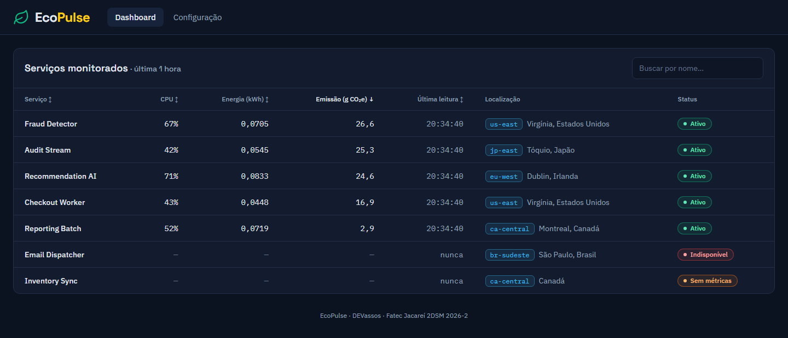

# 🌱 GreenER — Estimativa do Impacto Ambiental de Aplicações de Software

<div align="center">


**Projeto de Aprendizagem Baseada em Projetos (ABP) — 2º semestre de Desenvolvimento de Software Multiplataforma**
**FATEC Jacareí · 2026-2 · Parceiro: UniLaunch · Focal point: Prof. Rodrigo Silva Peres · Equipe: DEVassos**

</div>

---

## 1. Problema

Empresas operam dezenas ou centenas de aplicações distribuídas em várias regiões. Métricas de CPU, memória, armazenamento e rede são usadas para desempenho e disponibilidade, mas quase nunca para entender o **impacto ambiental** dessas aplicações. Gestores têm pouca visibilidade sobre o consumo energético dos sistemas e as emissões de carbono associadas.

## 2. Solução

O **GreenER** é uma plataforma web de observabilidade socioambiental (**GreenOps**) que monitora continuamente aplicações e microsserviços a partir de duas APIs do parceiro — o [Agregador de Métricas](https://metrics.unilaunch.org/docs) e o [Serviço de Intensidade de Carbono](https://carbon.unilaunch.org/docs). Ela traduz métricas de infraestrutura (**CPU, memória, disco e rede**) em **consumo energético (kWh)** e **pegada de carbono estimada (gCO₂e)**, ponderada pela intensidade de carbono da matriz elétrica da região onde cada serviço está hospedado. O ambiente monitorado é dinâmico: serviços surgem, ficam indisponíveis, deixam de exportar métricas e voltam, e a plataforma se adapta sem intervenção manual.

> 💡 **Princípio central:** software não consome energia diretamente, mas o hardware que o executa sim. O GreenER é uma ponte analítica entre a infraestrutura de TI e as metas corporativas de sustentabilidade e ESG.

Requisitos completos (RF01–RF15, RNF01–RNF05, RP01–RP07): [docs/requisitos.md](docs/requisitos.md).

Setup backend da #8 em revisão local: [organização e validação](backend/README.md) e [contrato de saúde](docs/api.md). A integração Docker/Compose depende das #26/#27; não representa uma funcionalidade mergeada.

## 3. Funcionalidades implementadas

O desenvolvimento acontece na branch `develop`; cada funcionalidade entra nesta lista quando o Pull Request correspondente é mergeado, com o requisito e o número do PR. A primeira versão executável está prevista para a Sprint 1 (review em 19/10/2026).

- **RF09, RF12 — Tabela operacional de serviços (#69):** dashboard com cada serviço monitorado, CPU, energia, emissão, última leitura, localização (região, cidade e país) e status (ativo, indisponível, sem métricas), com busca por nome e ordenação por coluna. Enquanto o backend não expõe `GET /services`, o frontend roda com dados ilustrativos ou com o backend falso (`npm run mock`); como executar em [frontend/README.md](frontend/README.md).

  

## 4. Escopo planejado

> Planejado, **ainda não implementado**. O andamento real está no [quadro do projeto](https://github.com/orgs/DEVassos/projects/6) e no [plano de entregas](docs/plano-de-entregas.md).

- **Descoberta dinâmica de serviços:** ingestão periódica resiliente via `/services` e `/metrics/{id}`, reconhecendo adições, remoções e quedas sem intervenção manual.
- **Motor de cálculo socioambiental:** potência (W), energia (kWh) e emissões (gCO₂e) pela fórmula oficial do desafio, com o fator regional da API de intensidade de carbono.
- **Dashboard em três níveis:** visão executiva (kWh total, gCO₂e, serviços ativos e indisponíveis, com atualização sem recarregar), análise comparativa (ranking e distribuição geográfica) e investigação detalhada (histórico por serviço).
- **Área de configuração autenticada:** JWT no backend e senhas com bcrypt.
- **Diferenciais em estudo:** simulação de migração para regiões com matriz mais limpa e exportação de relatórios em PDF/CSV ([proposta](docs/produto/diferenciais-devassos.pdf)).

## 5. Tecnologias

| Camada | Tecnologia (obrigatória pelo desafio, RP01–RP06) |
|---|---|
| Frontend | React + TypeScript (Vite, Tailwind CSS) |
| Backend | Node.js + TypeScript, API REST em módulos (routes, controllers, services, repositories) |
| Banco de dados | PostgreSQL com DDL e DML explícitos via driver `pg`, sem ORM |
| Segurança | JWT no backend e bcrypt para senhas |
| Execução | Docker Compose (frontend, backend e PostgreSQL com volume persistente) |

## 6. Equipe (DEVassos)

| | Integrante | Papel | GitHub |
| :---: | :--- | :--- | :---: |
|  | **Henrique Camargo** | Product Owner | [@henriqueptbd-cell](https://github.com/henriqueptbd-cell) |
|  | **Gabriel Travensolli** | Scrum Master | [@travensolli](https://github.com/travensolli) |
|  | **Andrea Turibio** | Desenvolvedora (frontend) | [@DeaTuribio](https://github.com/DeaTuribio) |
|  | **Lucas Amorim** | Desenvolvedor (backend) | [@LUCASAMR23](https://github.com/LUCASAMR23) |
|  | **Vinicius Augusto** | Desenvolvedor (backend e banco de dados) | [@viniciusaugusto1997](https://github.com/viniciusaugusto1997) |

## 7. Sprints

| Sprint | Período | Review (a confirmar) | Objetivo |
|---|---|---|---|
| 1 | 29/09 → 19/10/2026 | 19/10 às 19h30 | Pipeline de coleta persistido em Docker e primeira tela do dashboard (serviços com estado e localização, atualizando sem recarregar) |
| 2 | 20/10 → 09/11/2026 | 09/11 às 19h30 | Dashboard completo com energia, CO₂e, tolerância a falhas e área de configuração protegida por JWT |
| 3 | 10/11 → 23/11/2026 | 23/11 às 19h30 | Ranking de impacto, comparação entre serviços, mapa e repositório pronto como portfólio |

Critérios previstos, responsáveis e evidências de cada sprint: [docs/plano-de-entregas.md](docs/plano-de-entregas.md).

## 8. Como executar

Pré-requisitos: [Docker](https://www.docker.com/get-started) com Docker Compose e [Git](https://git-scm.com/).

```bash
git clone https://github.com/DEVassos/greener-app.git
cd greener-app
cp .env.example .env
docker compose up --build
```

| Serviço | URL | Situação |
|---|---|---|
| Frontend (dashboard) | http://localhost:5173 | no `compose.yaml` |
| Backend (API e `/health`) e PostgreSQL | — | entram no `compose.yaml` com as tarefas #26 e #27 |

Enquanto o backend não está no compose, o dashboard mostra o aviso "Não foi possível conectar ao servidor". Para ver a tabela preenchida, rode o backend falso no host (`cd frontend && npm ci && npm run mock`) ou deixe `VITE_API_URL` vazia no `.env` e suba com `docker compose up --build` para o modo demonstração. Detalhes da imagem do frontend em [frontend/README.md](frontend/README.md#execução-em-container).

`docker compose down` para os containers; `docker compose down -v` também apaga os volumes.

## 9. Como trabalhamos

- **Git Flow:** `main` recebe uma release por sprint (tag `sprint-N`); `develop` integra o trabalho; cada issue vira uma branch `tipo/<nº>-slug` e um Pull Request revisado por outra pessoa do time.
- **Backlog em três níveis:** épico (tema de requisitos) → história de usuário (com critérios de aceite) → tarefa técnica, ligados por sub-issues no [quadro](https://github.com/orgs/DEVassos/projects/6).
- Processo Scrum, papéis, cerimônias e Definition of Done: [docs/processo/README.md](docs/processo/README.md).
- Padrões de branch, commit e PR: [.github/CONTRIBUTING.md](.github/CONTRIBUTING.md).

## 10. Documentação

| Documento | Conteúdo |
|---|---|
| [docs/visao-do-produto.md](docs/visao-do-produto.md) | Posicionamento, personas, jornada, metas e fronteira do MVP |
| [docs/requisitos.md](docs/requisitos.md) | Requisitos funcionais, não funcionais e restrições do desafio |
| [docs/especificacao-api.md](docs/especificacao-api.md) | Contrato das APIs auxiliares do parceiro (Métricas e Intensidade de Carbono) |
| [docs/abp-2026-2.md](docs/abp-2026-2.md) | Raciocínio técnico: reconciliação dinâmica de serviços, estrutura de dados, perguntas ao parceiro |
| [docs/arquitetura/modelagem-uml.md](docs/arquitetura/modelagem-uml.md) | Modelagem UML (casos de uso, classes, sequências) |
| [docs/backlog/historias-de-usuario.md](docs/backlog/historias-de-usuario.md) | Histórias de usuário US01–US14 com critérios de aceite |
| [docs/plano-de-entregas.md](docs/plano-de-entregas.md) | Plano das sprints, critérios da rubrica, responsáveis e evidências |
| [docs/sprints/](docs/sprints/) | Registro de cada sprint: planejamento ([Sprint 1](docs/sprints/sprint-1/planning.md)), dailies, review, retrospectiva, participação |
| [docs/pontos-para-discutir.md](docs/pontos-para-discutir.md) | Decisões em aberto e dúvidas para o parceiro |
| [docs/produto/](docs/produto/) | Proposta de diferenciais e protótipo HTML do dashboard |
| [docs/adr/](docs/adr/) | Decisões de arquitetura (ADRs) |
| [docs/processo/](docs/processo/) | Como o time trabalha |
| [docs/contexto/](docs/contexto/) | Documentos do desafio (edital, documentação estendida, apresentação do kickoff, rubrica) |

Documentação técnica de execução (`docs/arquitetura.md`, `docs/api.md`, `docs/calculos.md`, READMEs de `frontend/`, `backend/` e `database/`) é criada junto com o código correspondente.

## 11. Status

**Sprint 1** (29/09 → 19/10/2026): em andamento.

---

<div align="center">
Desenvolvido com 💚 pela equipe <strong>DEVassos</strong> · FATEC Jacareí 2026 · Licença <a href="LICENSE">MIT</a>
</div>
