# Modelagem UML — GreenER

> **Tarefa:** ARQ-01 — Modelagem UML  
> **Documento vivo:** esta modelagem representa o produto GreenER previsto para o semestre. A implementação é incremental por sprint; portanto, elementos modelados aqui podem ainda não estar implementados na Sprint 1. Mudanças de requisito ou decisões arquiteturais devem ser refletidas neste documento.  
> **Fontes do projeto consideradas:** desafio oficial do 2DSM, `product-backlog.md`, `visao-do-produto.md`, `abp-2026-2.md`, `especificacao-api.md`, `pontos-para-discutir.md`, `sprints/sprint-1.md` e o protótipo visual do Dashboard GreenER.

---

## 1. Objetivo e escopo

Este documento consolida a modelagem UML do GreenER e serve como referência comum para Frontend, Backend e Banco de Dados.

A modelagem cobre:

- atores e funcionalidades do produto;
- entidades persistentes centrais;
- relacionamentos e multiplicidades;
- descoberta dinâmica e monitoramento dos serviços;
- coleta de métricas;
- cálculo de potência, energia e CO₂e;
- persistência histórica;
- dashboard e análises;
- autenticação JWT da área administrativa;
- evoluções previstas para histórico, ranking, mapa, comparação e simulação regional;
- exportação de dados/relatórios prevista no planejamento do projeto.

O documento **não afirma que todo o escopo já está implementado na Sprint 1**. Ele descreve a arquitetura funcional prevista para o produto e identifica a rastreabilidade por sprint.

---

## 1.1 Visão visual consolidada

A prancha abaixo resume os **casos de uso**, o **modelo persistente** e os **principais fluxos de sequência** do GreenER. Ela foi revisada para refletir os requisitos do projeto, os contratos das APIs UniLaunch e o comportamento previsto no Dashboard.

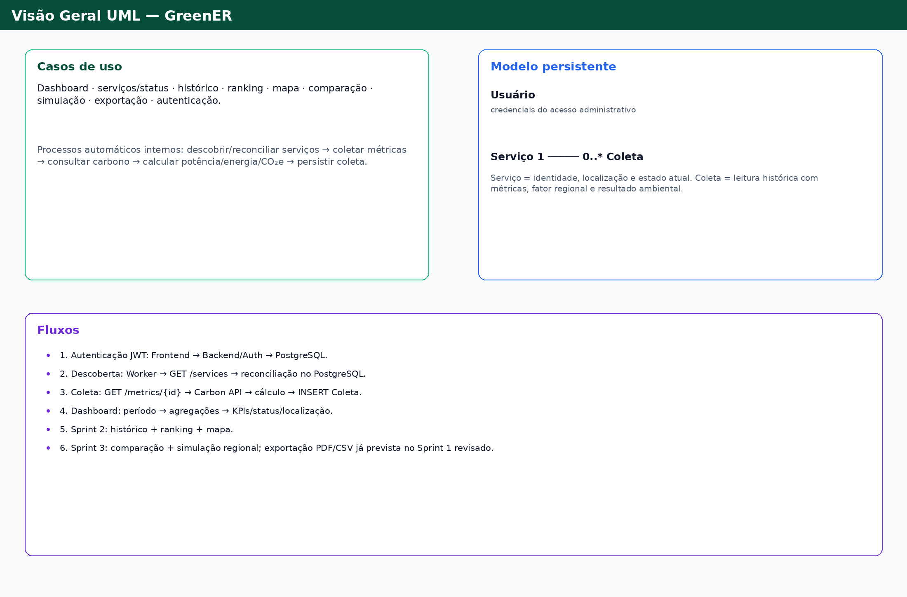

> **Fonte versionável:** os diagramas Mermaid das seções seguintes permanecem como fonte textual e versionável da modelagem. A imagem acima é a representação visual consolidada para leitura rápida no GitHub.

> **Importante para visualização:** as imagens usam caminhos relativos. No GitHub, elas aparecem normalmente desde que `modelagem-uml.md` e a pasta `diagramas/` sejam enviados juntos mantendo esta estrutura de diretórios. Abrir apenas o `.md` isolado fora da pasta do projeto pode ocultar as imagens.


---

## 2. Fronteira do sistema

O GreenER é composto, conceitualmente, por:

- **Frontend:** React + TypeScript;
- **Backend:** Node.js + TypeScript, organizado em módulos, controllers e services;
- **Banco:** PostgreSQL, com DDL/DML explícitos e sem ORM;
- **Worker de coleta:** executa o ciclo periódico de descoberta, métricas e processamento;
- **Greener Metrics Aggregator API:** fonte externa dos serviços e métricas;
- **Greener Carbon Intensity API:** fonte externa do fator regional de carbono;
- **Docker:** execução containerizada da aplicação.
- **Dashboard GreenER:** camada visual que consome dados consolidados do Backend e materializa KPIs, ranking, mapa, histórico, comparação e simulação conforme a sprint correspondente.

As APIs UniLaunch são **sistemas externos**. Seus objetos de resposta não devem ser confundidos automaticamente com entidades persistentes do GreenER.

---

# 3. Diagrama de Casos de Uso

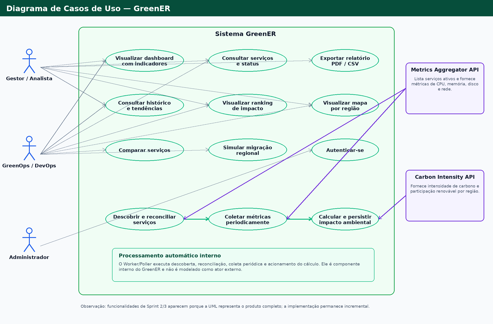

> A imagem acima é a representação visual. O bloco Mermaid abaixo permanece como fonte textual/versionável.

> Mermaid não possui uma notação nativa específica para diagramas UML de caso de uso. Por isso, a representação abaixo usa `flowchart` mantendo os elementos conceituais de UML: **atores, fronteira do sistema e casos de uso**.

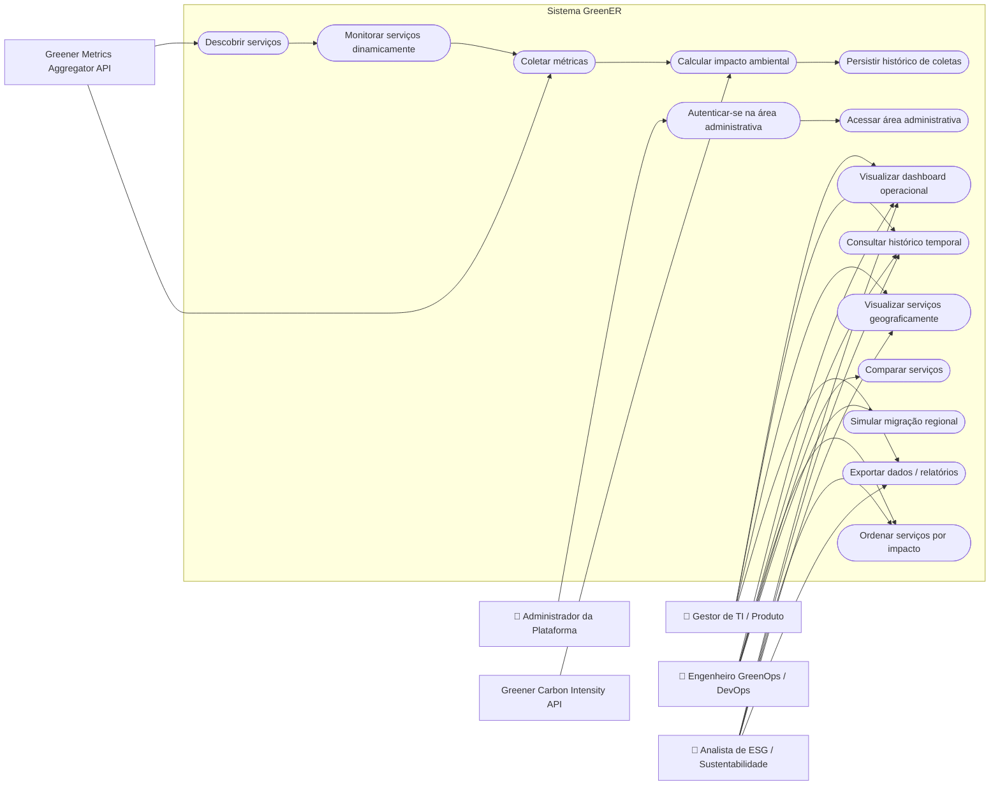

### 3.1 Interpretação

Os casos de uso `Descobrir serviços`, `Monitorar serviços dinamicamente`, `Coletar métricas`, `Calcular impacto ambiental` e `Persistir histórico de coletas` são processos automáticos do sistema e interagem com as APIs externas.

Os atores humanos refletem as personas já definidas pelo projeto:

- **Gestor de TI / Produto:** visão executiva, acompanhamento e relatórios;
- **Engenheiro GreenOps / DevOps:** investigação, ranking, comparação e otimização;
- **Analista de ESG / Sustentabilidade:** indicadores ambientais, histórico e exportação;
- **Administrador da Plataforma:** autenticação e acesso à área restrita.

### 3.2 Rastreabilidade dos casos de uso

| Caso de uso | Requisito / história | Planejamento |
|---|---|---|
| Descobrir serviços | RF01 / US01 | Sprint 1 |
| Monitorar serviços dinamicamente | RF02, RF05, RF06 / US01 | Sprint 1 |
| Coletar métricas | RF03, RF04 / US01 | Sprint 1 |
| Calcular impacto ambiental | RF07 / US02 | Sprint 1 |
| Persistir histórico | RF10 / US03 | Sprint 1 (persistência) |
| Visualizar dashboard | RF08, RF09, RF11, RF12 / US04 | Sprint 1 |
| Autenticar / acessar área administrativa | RP06 / US07 | Sprint 1 |
| Consultar histórico temporal | RF10 / US08 | Sprint 2 |
| Ordenar por impacto | RF14 / US09 | Sprint 2 |
| Visualizar geograficamente | RF13 / US10 | Sprint 2 |
| Comparar serviços | RF15 / US11 | Sprint 3 |
| Simular migração regional | diferencial / US12 | Sprint 3 |
| Exportar dados / relatórios | diferencial / mecanismo global de exportação | Sprint 1 (planejamento revisado) |

> **Atualização de planejamento:** a revisão mais recente de `sprints/sprint-1.md` incorporou explicitamente o **Mecanismo Global de Exportação de Relatórios Gerenciais (PDF e CSV)** ao MVP da Sprint 1. Por isso, esta versão da UML trata a exportação como entrega da Sprint 1. Caso o Product Backlog mantenha referência anterior à Sprint 3, essa divergência deve ser sincronizada pelo time para preservar a rastreabilidade documental.


## 3.3 Alinhamento com o Dashboard GreenER

O protótipo visual do Dashboard é tratado como **visão de interface do mesmo domínio**, e não como uma arquitetura paralela. A UML deve fornecer os dados e fluxos necessários para que a interface seja implementada sem criar entidades artificiais apenas para atender componentes visuais.

| Elemento do Dashboard | Origem no modelo / fluxo | Rastreabilidade |
|---|---|---|
| **Energia total (kWh)** | agregação de `Coleta.energia_kwh` por período | RF08 / RF10 |
| **Emissão total (g CO₂e)** | agregação de `Coleta.emissao_gco2e` por período | RF08 / RF10 |
| **Intensidade média (g CO₂e/kWh)** | fator regional registrado nas coletas, ponderado pela energia | RF07 / RF12 |
| **Serviços monitorados** | `Servico` + `status` inferido pelo monitoramento | RF01, RF05, RF06 |
| **Disponível / sem métricas / indisponível** | reconciliação do Worker e respostas 200/404/500 da Metrics API | RF05, RF06 |
| **Última atualização / intervalo de coleta** | `Servico.ultima_vez_visto`, `Coleta.coletado_em` e `intervalo_coleta_segundos` | RF04 / RNF02 |
| **Ranking por CO₂e ou energia** | agregações e ordenação das coletas por serviço | RF14 / US09 |
| **Mapa e regiões monitoradas** | localização persistida em `Servico` (`region_code`, latitude, longitude) | RF12, RF13 / US10 |
| **Histórico, linha, barras e composição** | série temporal de `Coleta` filtrada por período e região | RF10 / US08 |
| **Memória de cálculo** | métricas brutas + constantes oficiais + fator regional | RF07 / US02 |
| **Comparar** | consulta de dois ou mais serviços no mesmo período | RF15 / US11 |
| **Potencial de redução / “E se migrássemos?”** | simulação com fator da região de destino, sem alterar histórico real | US12 |
| **Entrar / Configuração** | autenticação `POST /login`, bcrypt e JWT | RP06 / US07 |
| **PDF / CSV** | exportação dos dados consolidados exibidos no relatório gerencial | Sprint 1 revisada |

O Dashboard atualmente antecipa elementos que pertencem a **Sprints 2 e 3**, como ranking, mapa, comparação e simulação. Isso é aceitável porque esta modelagem representa o **produto completo previsto para o semestre**, enquanto a implementação continua incremental. A interface não altera a regra de persistência: `Servico` representa o estado atual do serviço e `Coleta` preserva o histórico temporal.


---

# 4. Diagrama de Classes — Modelo Persistente

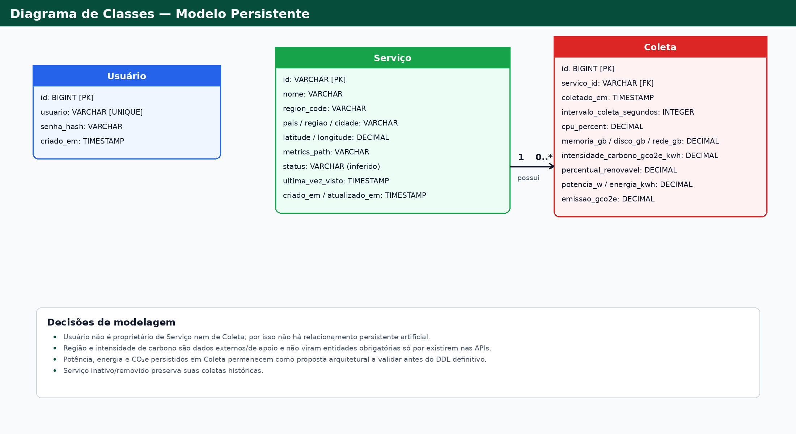

> O modelo persistente oficial mantém somente a relação `Servico 1 → 0..* Coleta`; `Usuario` não é proprietário de serviços ou coletas.

A ARQ-01 exige a modelagem das entidades `usuarios`, `servicos` e `coletas`. O diagrama abaixo representa o modelo persistente conceitual que servirá de referência para `database/schema.sql`.

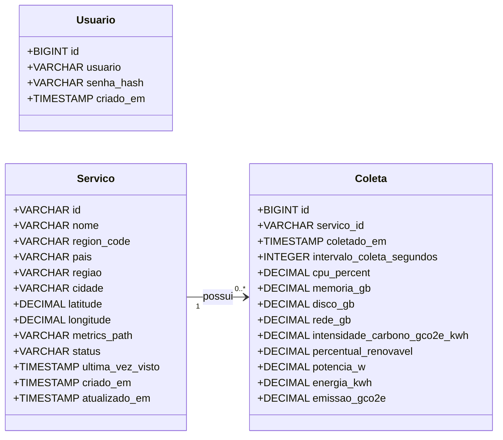

---

## 5. Responsabilidades das entidades

### 5.1 `Usuario`

Representa as credenciais da área administrativa.

| Atributo | Responsabilidade |
|---|---|
| `id` | Identificador interno. |
| `usuario` | Identificador utilizado no login. |
| `senha_hash` | Hash bcrypt da senha. Senha em texto puro não deve ser persistida. |
| `criado_em` | Momento de criação do registro. |

No MVP, o administrador inicial é provisionado por `database/seed.sql`. Cadastro público e gestão completa de usuários estão fora do MVP.

Não existe requisito atual que torne um usuário proprietário de um serviço ou de uma coleta. Por isso, **não é criado relacionamento artificial entre `Usuario` e `Servico`/`Coleta`**.

### 5.2 `Servico`

Representa um serviço descoberto dinamicamente no `GET /services` da Metrics Aggregator API.

| Atributo | Responsabilidade |
|---|---|
| `id` | Identificador estável fornecido pela API, por exemplo `billing-api`. |
| `nome` | Nome legível do serviço. |
| `region_code` | Código regional utilizado para consultar a Carbon Intensity API. |
| `pais` | País da localização. |
| `regiao` | Região geográfica. |
| `cidade` | Cidade, quando fornecida. |
| `latitude` / `longitude` | Coordenadas aproximadas, quando fornecidas. |
| `metrics_path` | Caminho de métricas informado pelo agregador. |
| `status` | Estado inferido pelo GreenER a partir do monitoramento. |
| `ultima_vez_visto` | Última descoberta do serviço na listagem externa. |
| `criado_em` | Momento em que o GreenER conheceu o serviço. |
| `atualizado_em` | Última atualização de seu estado persistido. |

O `/services` é tratado como fonte da verdade do momento. O sistema deve reconhecer inclusão, remoção, indisponibilidade e retorno de serviços sem reinicialização.

### 5.3 `Coleta`

Representa uma leitura histórica de um serviço em determinado instante.

| Atributo | Responsabilidade |
|---|---|
| `id` | Identificador interno da coleta. |
| `servico_id` | Referência obrigatória ao serviço monitorado. |
| `coletado_em` | Momento da leitura. |
| `intervalo_coleta_segundos` | Intervalo informado pela API de métricas. |
| `cpu_percent` | Uso de CPU. |
| `memoria_gb` | Uso de memória. |
| `disco_gb` | Uso de disco. |
| `rede_gb` | Uso/tráfego de rede. |
| `intensidade_carbono_gco2e_kwh` | Fator regional utilizado no cálculo. |
| `percentual_renovavel` | Participação renovável informada para a região. |
| `potencia_w` | Potência estimada. |
| `energia_kwh` | Energia estimada no intervalo. |
| `emissao_gco2e` | Emissão estimada da coleta. |

A coleta é histórica: novas leituras geram novos registros em vez de sobrescrever registros anteriores.

---

## 6. Relacionamentos e multiplicidades

### `Servico 1 → 0..* Coleta`

- Um serviço pode ser descoberto antes da primeira leitura; portanto, pode possuir **zero coletas**.
- Ao longo do monitoramento, um serviço pode possuir **muitas coletas**.
- Toda coleta pertence obrigatoriamente a **um único serviço**.
- `Coleta.servico_id` representa a futura FK para `Servico.id`.
- A inativação/remoção lógica de um serviço não deve destruir seu histórico.

Conceitualmente:

```text
Billing API
   ├── coleta 20:00
   ├── coleta 20:01
   └── coleta 20:02
```

A entidade `Servico` representa **quem é monitorado e seu estado atual**. A entidade `Coleta` representa **o que foi observado em um instante**.

---

# 7. Diagramas de Sequência

Os diagramas seguintes detalham os fluxos centrais do produto. Eles representam responsabilidades e interações; nomes de endpoints internos só são utilizados quando já definidos pelos documentos do projeto.

## 7.1 Autenticação JWT — Sprint 1

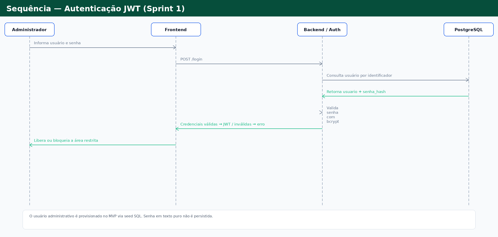

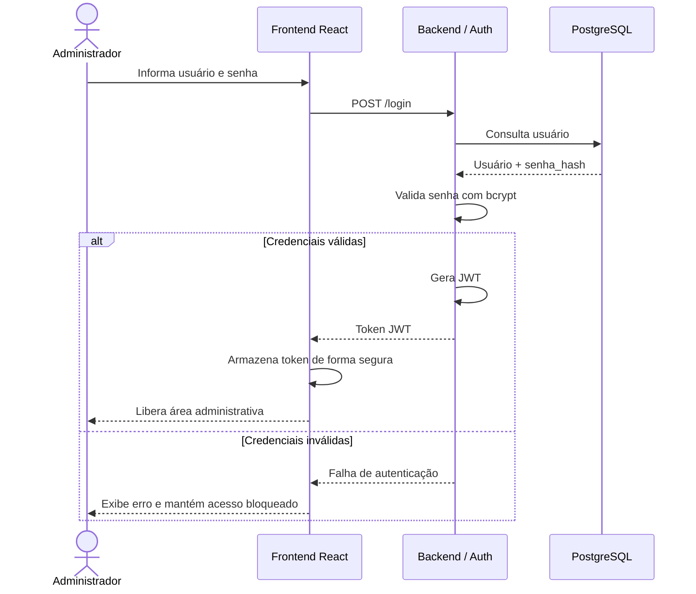

## 7.2 Descoberta, reconciliação e coleta — Sprint 1

### 7.2.1 Descoberta e reconciliação

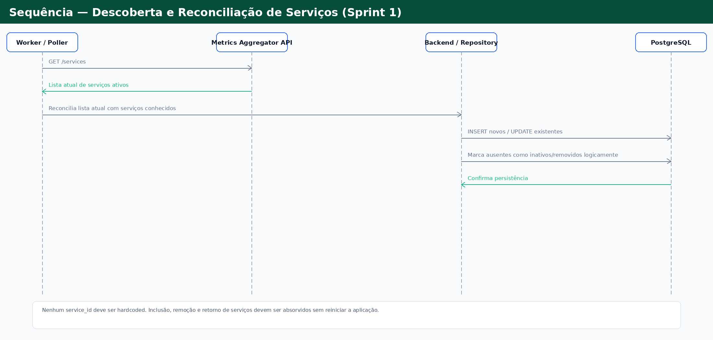

### 7.2.2 Coleta, carbono, cálculo e persistência

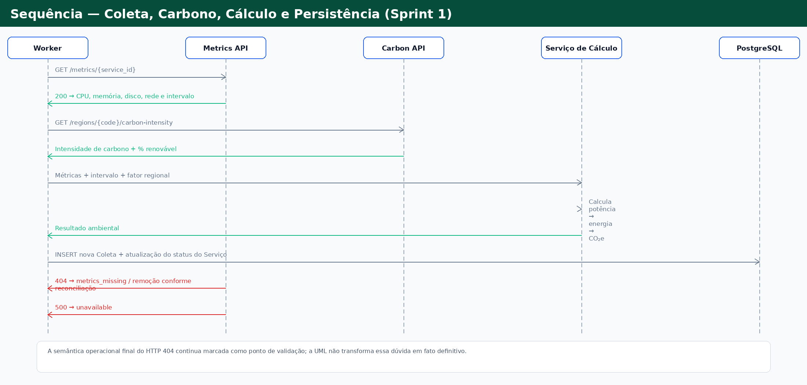

> As duas imagens separam visualmente responsabilidades que no Mermaid abaixo aparecem no mesmo fluxo consolidado.

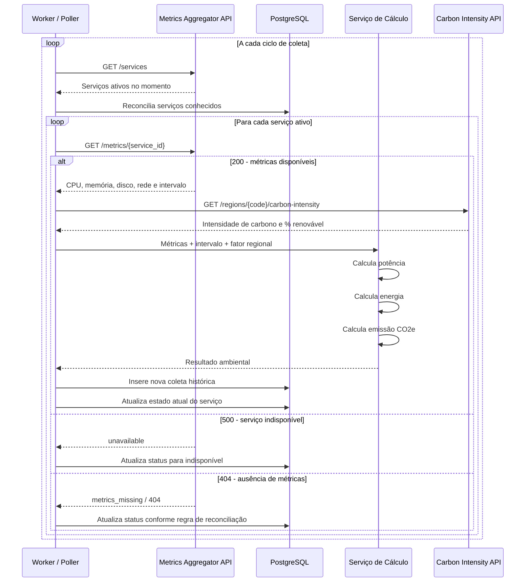

> A interpretação definitiva do HTTP `404` continua pendente de validação com o parceiro: os documentos registram dúvida sobre `metrics_missing` versus serviço removido.

## 7.3 Dashboard operacional — Sprint 1

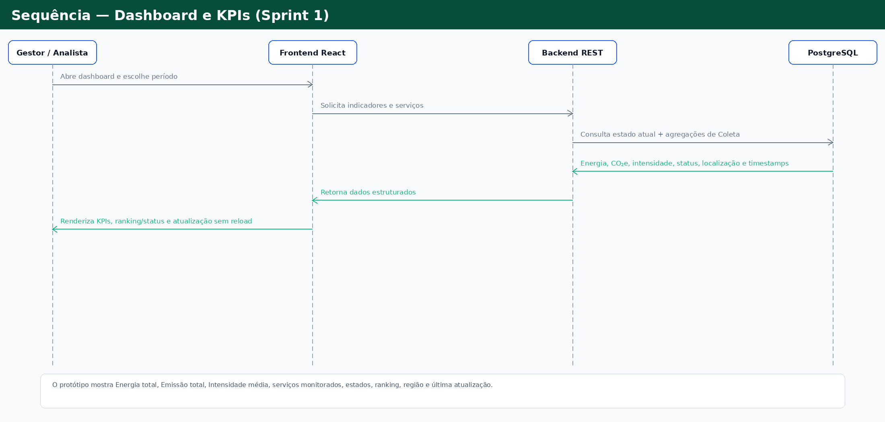

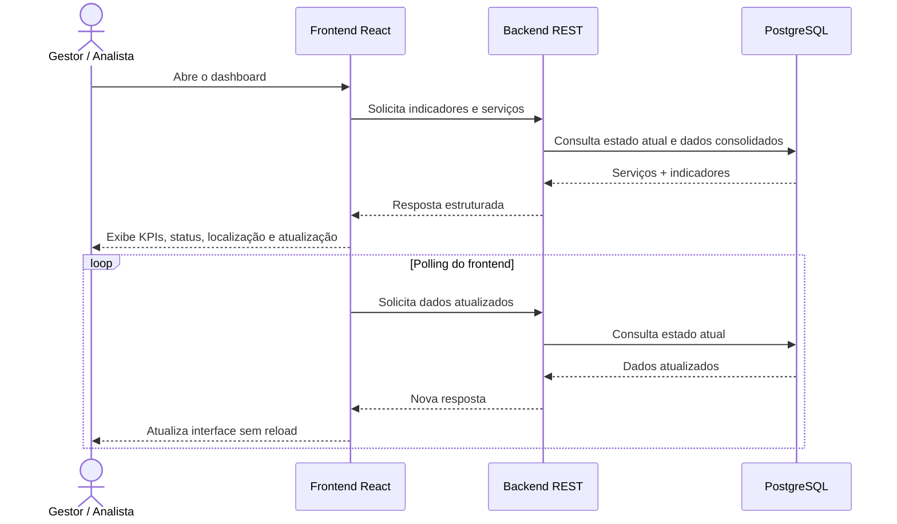

## 7.4 Consulta de histórico e ranking — Sprint 2

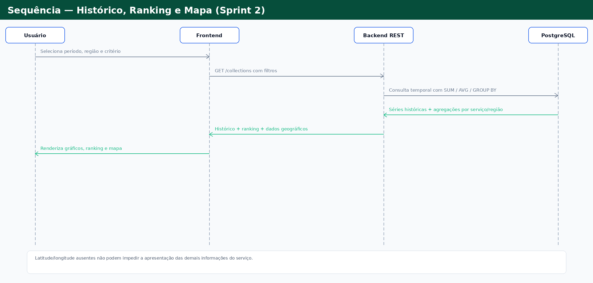

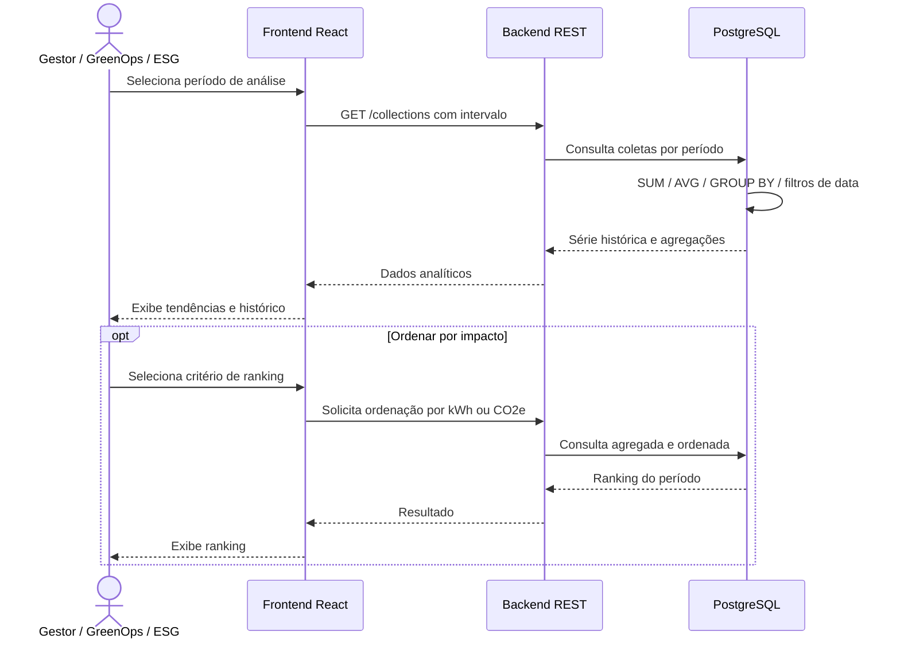

## 7.5 Comparação entre serviços — Sprint 3

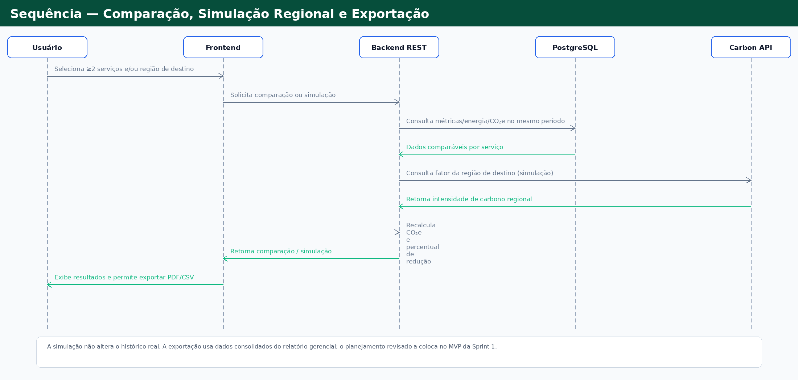

> A prancha visual agrupa comparação, simulação regional e exportação porque compartilham o mesmo conjunto consolidado de dados; os Mermaid seguintes continuam detalhando comparação e simulação separadamente.

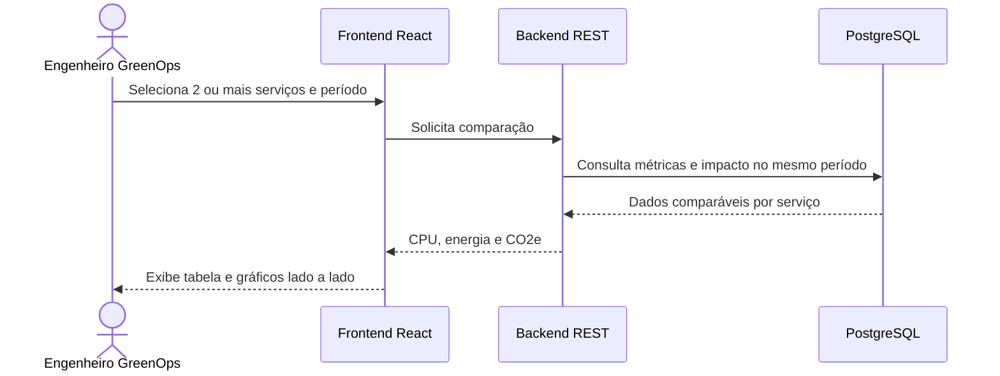

## 7.6 Simulação de migração regional — Sprint 3

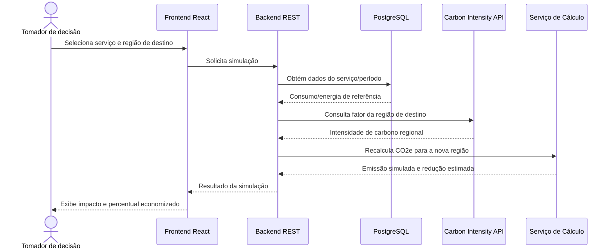

---

# 8. Fluxo arquitetural consolidado

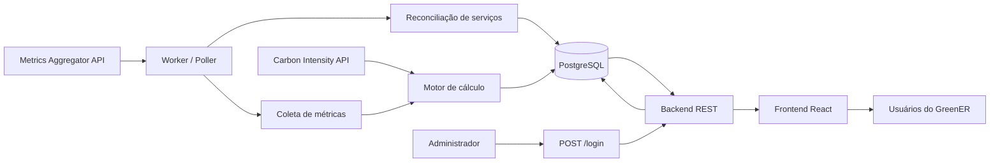

O fluxo principal é:

**APIs externas → Worker → Processamento → PostgreSQL → Backend REST → Frontend → Usuário.**

A autenticação da área administrativa atravessa **Frontend → Backend → PostgreSQL**, com bcrypt e JWT.

---

# 9. Regras de negócio e integridade derivadas da modelagem

1. O GreenER não deve hardcodar a lista de serviços.
2. `GET /services` é a fonte da verdade para os serviços presentes no ciclo atual.
3. A aplicação deve adaptar-se a inclusão, remoção, indisponibilidade e retorno de serviços sem reinicialização.
4. Cada coleta pertence obrigatoriamente a um serviço.
5. Um serviço pode existir antes de possuir sua primeira coleta.
6. O histórico de coletas deve ser preservado para análise temporal.
7. Novas leituras devem gerar novos registros históricos; não devem sobrescrever coletas anteriores.
8. Falha em um serviço ou API auxiliar não deve derrubar toda a aplicação.
9. O cálculo ambiental deve utilizar as constantes oficiais do desafio:
   - CPU: `100 W`;
   - RAM: `0,375 W/GB`;
   - Disco: `0,01 W/GB`;
   - Rede: `0,02 W/GB`.
10. Energia deve considerar potência e intervalo de coleta.
11. Emissão de CO₂e deve considerar energia e intensidade de carbono regional.
12. A localização deve ser preservada para país, região e, quando disponível, cidade e coordenadas.
13. Ausência de latitude/longitude não pode impedir a exibição das demais informações do serviço.
14. Senhas não devem ser persistidas em texto puro; o MVP utiliza bcrypt.
15. A área administrativa utiliza autenticação JWT.
16. O PostgreSQL deve ser acessado por SQL explícito/parametrizado e sem ORM.
17. A aplicação completa deve ser executável por containers Docker.
18. O volume do PostgreSQL deve preservar dados entre reinicializações.

---

# 10. Decisões arquiteturais e pontos ainda abertos

Esta seção evita transformar dúvidas atuais do projeto em fatos definitivos.

## 10.1 Nomenclatura das tabelas — pendente de fechamento

O Product Backlog e a ARQ-01 utilizam:

- `usuarios`;
- `servicos`;
- `coletas`.

O documento técnico anterior utiliza `services` e `service_readings`.

**Decisão adotada nesta UML:** português, para manter alinhamento direto com US03 e ARQ-01. A equipe deve confirmar o padrão antes do DDL definitivo.

## 10.2 Persistência de potência, energia e CO₂e — proposta arquitetural

US02 exige que esses valores sejam calculados, mas `pontos-para-discutir.md` ainda registra como aberta a decisão entre:

- persistir os resultados calculados; ou
- recalculá-los sob demanda.

**Proposta desta UML:** persistir `potencia_w`, `energia_kwh` e `emissao_gco2e` em `Coleta`, pois isso preserva o resultado histórico utilizado no momento da leitura e facilita as consultas analíticas previstas. A decisão deve ser validada pelo time antes de virar DDL definitivo.

## 10.3 Status do serviço — parcialmente aberto

O retorno documentado de `GET /services` não contém um campo `status`. O GreenER deve inferir o estado durante o monitoramento.

Estados previstos pelo material do projeto incluem:

- `available`;
- `unavailable`;
- `metrics_missing`.

A representação definitiva de serviço removido/inativo e a semântica exata do HTTP `404` ainda dependem de fechamento com o parceiro.

## 10.4 Preservação de serviço removido — proposta coerente com histórico

Como `Coleta` depende de `Servico` e RF10 exige histórico, a estratégia recomendada é não destruir fisicamente o serviço apenas porque deixou de aparecer na API. Seu estado pode ser marcado como removido/inativo, preservando a integridade do histórico.

## 10.5 Tipos e restrições SQL — responsabilidade do DDL

A UML define a intenção conceitual. O fechamento de:

- tamanhos de `VARCHAR`;
- precisão/escala de `DECIMAL`;
- `CHECK` constraints;
- índices;
- `NOT NULL`;
- `UNIQUE`;
- estratégia de `ON DELETE`;
- tipos de timestamp;

deve ocorrer em `database/schema.sql`, respeitando esta modelagem.

---

# 11. Rastreabilidade consolidada

| Elemento UML | Fonte funcional |
|---|---|
| Descoberta dinâmica | RF01 / US01 |
| Inclusão, remoção e retorno | RF02 / US01 |
| Coleta periódica | RF03, RF04 / US01 |
| `unavailable` / `metrics_missing` | RF05, RF06 / US01 |
| Cálculo ambiental | RF07 / US02 |
| KPIs consolidados | RF08 / US04 |
| Dashboard operacional | RF09 / US04 |
| Histórico persistente | RF10 / US03 e US08 |
| Atualização sem reload | RF11 / US04 |
| Localização | RF12 / US04 |
| Mapa | RF13 / US10 |
| Ranking | RF14 / US09 |
| Comparação | RF15 / US11 |
| Simulação regional | diferencial / US12 |
| Autenticação JWT | RP06 / US07 |
| `usuarios`, `servicos`, `coletas` | US03 / ARQ-01 |
| SQL puro / sem ORM | RP03 / US03 |
| Docker + PostgreSQL persistente | RP04 / US05 |
| Tolerância a falhas | RNF04 / US01 |
| Documentação técnica/modelo de dados | RNF05 / ARQ-01 |

---

# 12. Relação com as Sprints

## Sprint 1 — base operacional

A modelagem já suporta:

- descoberta e ingestão;
- cálculo ambiental;
- persistência PostgreSQL;
- histórico armazenado;
- dashboard operacional;
- autenticação JWT;
- infraestrutura Docker;
- exportação gerencial em PDF/CSV conforme o planejamento revisado da Sprint 1.

## Sprint 2 — análise

A mesma base evolui para:

- consultas temporais;
- gráficos históricos;
- ranking de impacto;
- visualização geográfica.

## Sprint 3 — diferenciais

A arquitetura suporta:

- comparação entre serviços;
- simulação de migração regional;
- refinamento da comparação e da simulação regional;
- refinamento final.

Assim, o documento pode ser entregue já na Sprint 1 como **visão arquitetural completa do produto**, sem afirmar que funcionalidades das Sprints 2 e 3 já estão implementadas.

---

# 13. Critérios de validação da ARQ-01

Antes de considerar a tarefa concluída:

- [x] Modelagem documentada em Markdown.
- [x] Prancha visual consolidada incorporada ao Markdown.
- [x] UML alinhada ao protótipo do Dashboard sem criar entidades artificiais.
- [x] Diagrama de classes em Mermaid.
- [x] Entidade `Usuario` modelada.
- [x] Entidade `Servico` modelada.
- [x] Entidade `Coleta` modelada.
- [x] Atributos principais documentados.
- [x] Relacionamento e multiplicidade `Servico 1 → 0..* Coleta`.
- [x] Diagrama de casos de uso integrado aos requisitos.
- [x] Diagramas de sequência dos fluxos centrais.
- [x] Rastreabilidade com RFs, RPs e User Stories.
- [x] Separação entre Sprint 1 e evoluções posteriores.
- [x] Pontos ainda abertos identificados explicitamente.
- [ ] Revisão conjunta com Frontend.
- [ ] Revisão conjunta com Backend.
- [ ] Revisão conjunta com Banco de Dados.
- [ ] Ajustes resultantes da revisão incorporados.
- [ ] Mermaid validado no ambiente/repositório antes do merge.

---

# 14. Resultado esperado

Este documento é a referência UML integrada do GreenER para o estado atual do planejamento.

Ele deve orientar:

- implementação de `database/schema.sql`;
- repositories SQL;
- módulos/controllers/services do backend;
- worker de coleta;
- integração com as APIs UniLaunch;
- fluxos do frontend e componentes de dados do Dashboard;
- evolução das funcionalidades ao longo das sprints.

A modelagem deve permanecer versionada junto ao código e ser atualizada quando uma decisão pendente for fechada ou quando um requisito do produto mudar.
