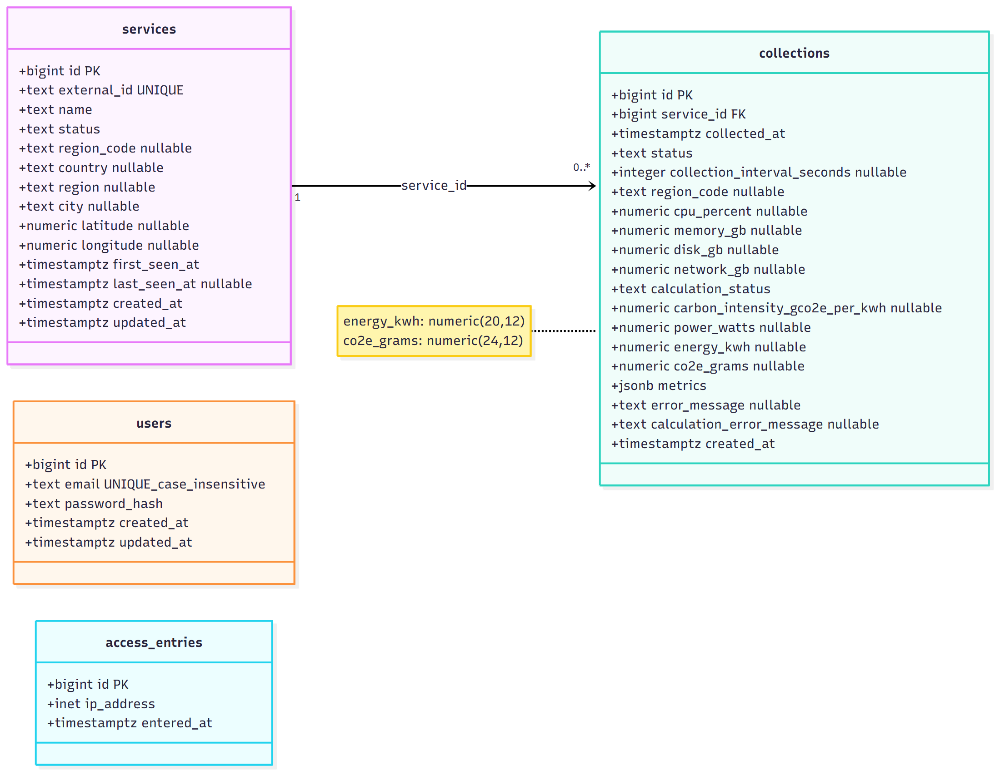
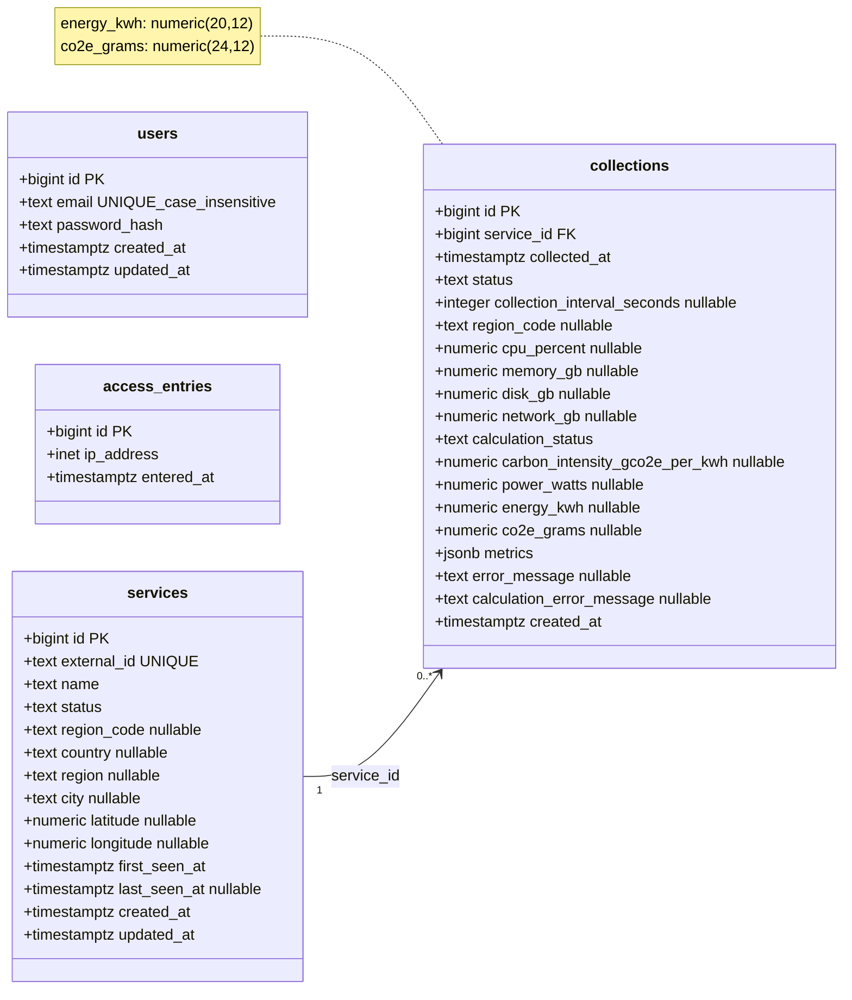
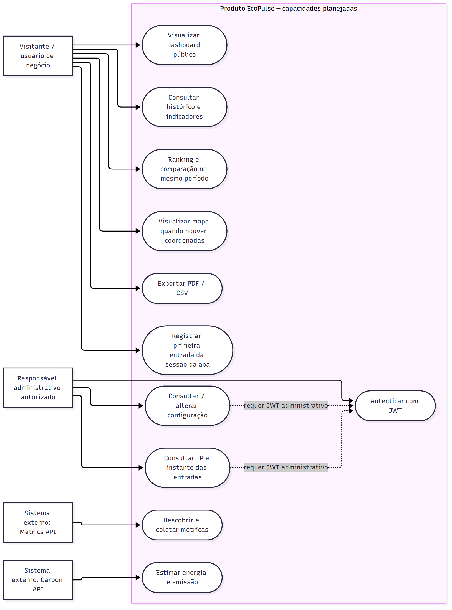
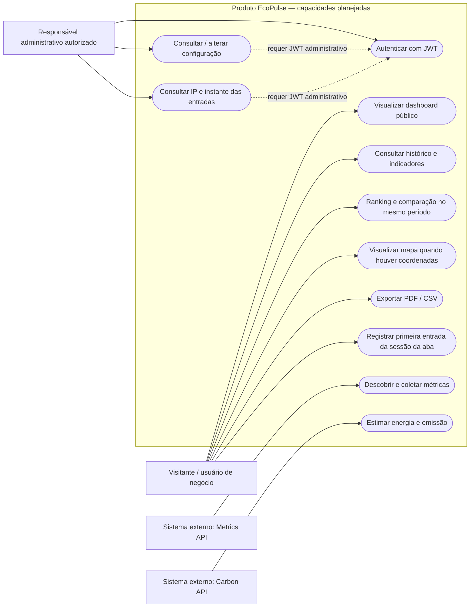
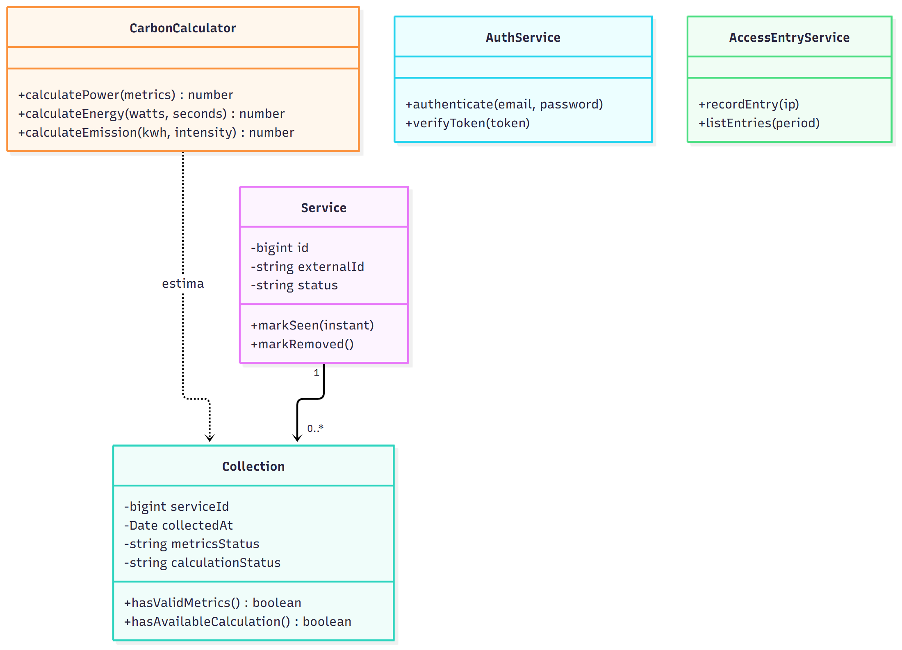
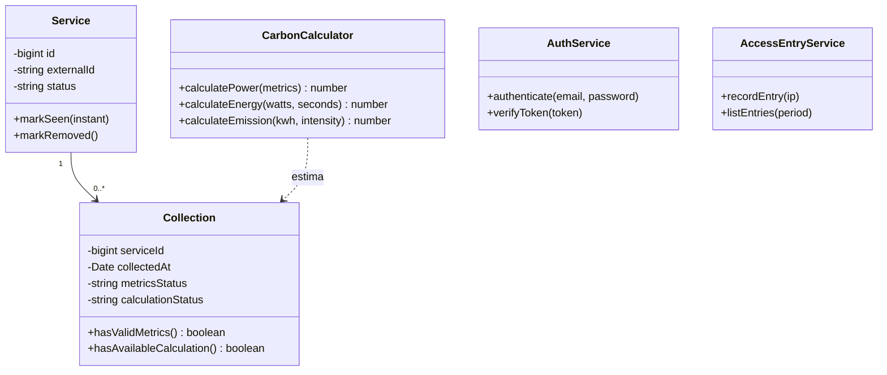
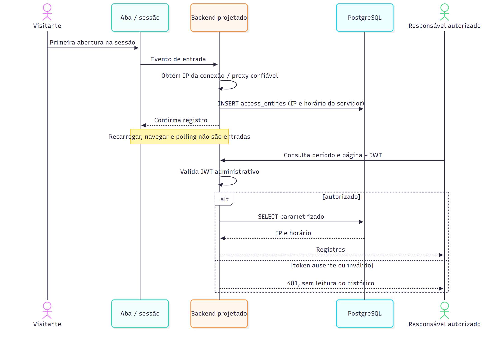
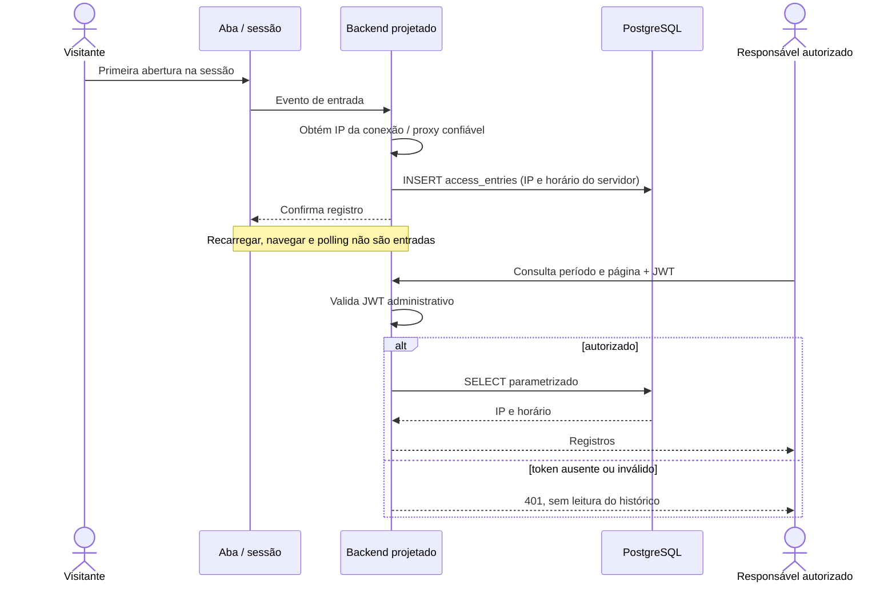
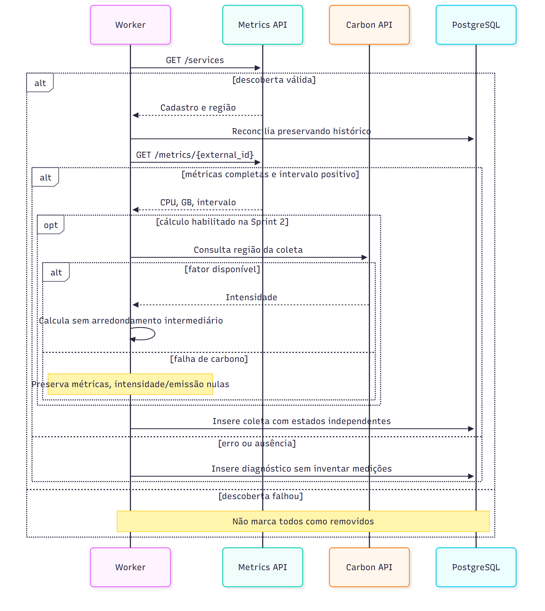
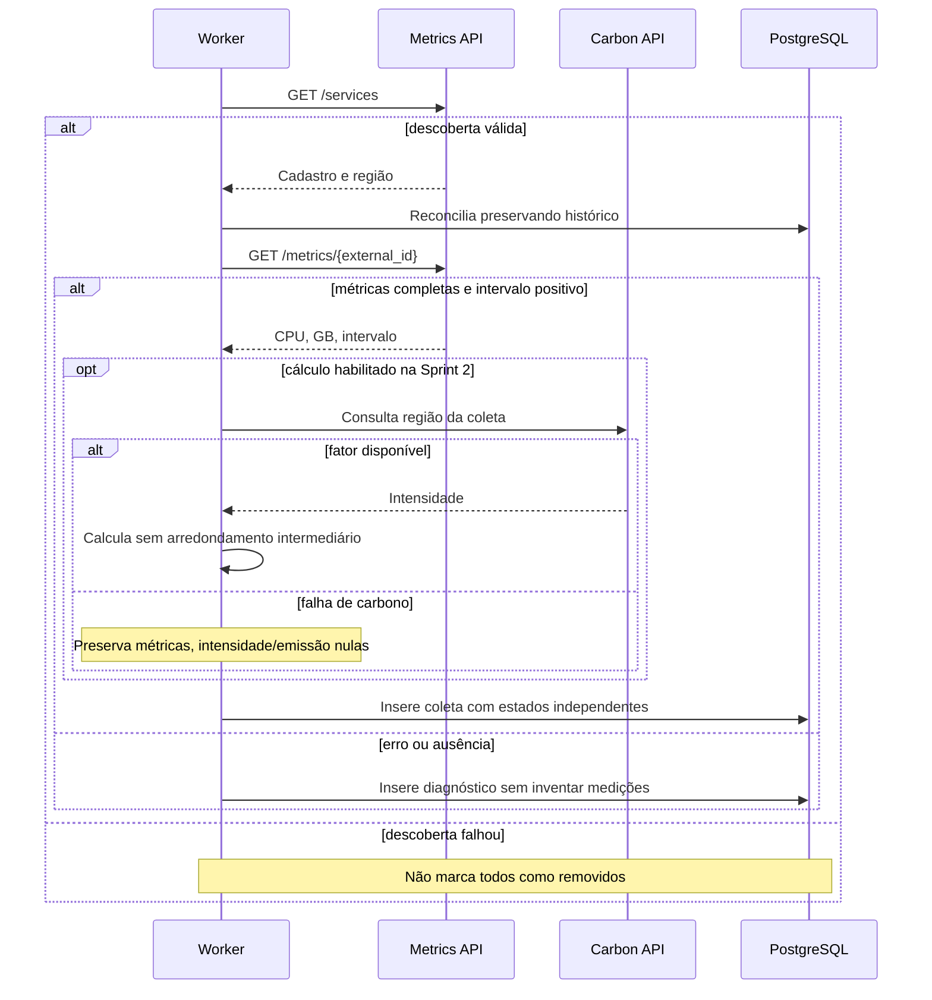

# Modelagem UML — integração do banco

Modelo proposto nesta branch para revisão de Vinicius, Frank e equipe. Integra a modelagem versionada (#28), a v2 local e o SQL de Lucas (#5/#44). Não declara backend, worker, JWT ou auditoria implementados. EcoPulse é o nome atual; a transição dos documentos permanece na #68.

## Fontes e sprints

Foram lidos os três PDFs e o DOCX originais em `docs/contexto/`. Matriz e divergências: [registro da integração](integracao-modelagem-banco.md). O edital confirma métricas em GB e JWT na configuração. Plano atual: coleta/persistência na Sprint 1; cálculo/OO/JWT na Sprint 2; ranking/comparação/exportação na Sprint 3. Auditoria simples solicitada por Vinicius: issue e sprint pendentes. Preparar colunas não implementa funcionalidades futuras.

`database/schema.sql` é a fonte física de tipos, constraints e índices. Esta visão a espelha; o modelo OO é separado e conceitual.

## Modelo persistente

PKs: `bigint GENERATED ALWAYS AS IDENTITY`. Toda coleta pertence a um serviço, que pode ter zero coletas. FK `ON DELETE RESTRICT`; usuários e entradas independentes, sem FK artificial.

### Tipos, nulabilidade e índices

| Campos | Tipo | Regra |
|---|---|---|
| `services.external_id`, `name`, `status` | `text` | Obrigatórios; ID externo único; estados ativo/indisponivel/sem_metricas/removido. |
| Cadastro regional (`region_code`, `country`, `region`, `city`) | `text` | Opcional; código presente não vazio; falha externa não apaga cadastro conhecido. |
| Latitude / longitude | `numeric(8,6)` / `numeric(9,6)` | Opcionais; limites geográficos. |
| `first_seen_at`, `created_at`, `updated_at` | `timestamptz` | Obrigatórios, default now(); last_seen_at opcional e não anterior à primeira descoberta. |
| `collections.service_id`, `collected_at`, `created_at` | `bigint`, `timestamptz`, `timestamptz` | Obrigatórios; datas default now(). |
| `collection_interval_seconds` | `integer` | Positivo para métricas válidas; nulo em falha/ausência. |
| `cpu_percent` | `numeric(5,2)` | 0–100, obrigatório para métricas válidas. |
| `memory_gb`, `disk_gb`, `network_gb` | `numeric(20,9)` | GB declarados pela API, finitos e não negativos; obrigatórios para métricas válidas. |
| `collections.region_code` | `text` | Snapshot da coleta; obrigatório para cálculo disponível, não depende do cadastro futuro. |
| Intensidade, potência | `numeric(14,6)` | Nulos conforme estado do cálculo; finitos e não negativos. |
| `energy_kwh` | `numeric(20,12)` | Resolução 10⁻¹² kWh e oito dígitos inteiros; nulo conforme estado do cálculo. |
| `co2e_grams` | `numeric(24,12)` | Resolução 10⁻¹² g e doze dígitos inteiros; nulo conforme estado do cálculo. Limites em [cálculos](../calculos.md). |
| `status`, `calculation_status` | `text` | Obrigatórios; semânticas independentes na tabela abaixo. |
| `metrics` | `jsonb` | Obrigatório, default {}; objeto bruto de /metrics, sem duplicação manual de fatores/resultados. |
| `error_message`, `calculation_error_message` | `text` | Erro de métricas exige mensagem; cálculo indisponível exige mensagem própria. |
| `users.email`, `password_hash` | `text` | Obrigatórios; email único sem diferenciar caixa; hash bcrypt. Regex não valida senha criptograficamente. |
| `users.created_at`, `updated_at` | `timestamptz` | Obrigatórios, default now(). |
| `access_entries.ip_address`, `entered_at` | `inet`, `timestamptz` | Obrigatórios; IP observado no backend e horário do servidor. |

Quatro índices explícitos: lower(email), coletas por (service_id, collected_at DESC) e collected_at DESC, entradas por entered_at DESC. Mais cinco índices automáticos: quatro PKs e UNIQUE de services.external_id. Total: nove índices. As consultas da aplicação ainda não foram implementadas.

### Estados e histórico

| Métricas: status | calculation_status | Significado |
|---|---|---|
| ok | nao_calculado | CPU, GB e intervalo válidos; campos ambientais nulos. Coleta da Sprint 1 sem antecipar cálculo. |
| ok | disponivel | Região, intensidade, potência, energia e emissão presentes; sem erro de cálculo. |
| ok | indisponivel | Métricas preservadas; intensidade/emissão nulas; potência/energia podem existir juntas; mensagem explica falha. |
| erro / sem_metricas | nao_calculado | Métricas normalizadas e cálculos nulos; erro exige mensagem; JSON pode preservar diagnóstico não sensível. |

Desconhecido é NULL; zero é valor conhecido. Falha de carbono não é falha de métricas. CHECKs validam estrutura, não a fórmula; integração futura valida a resposta bruta antes de gravar.

Cada ciclo insere uma linha. A FK não impede UPDATE/DELETE de coletas: somente inserção será regra dos repositories/permissões. Sem triggers nesta tarefa. updated_at DEFAULT now() atua na inserção; UPDATEs futuros de serviços/usuários atribuirão updated_at = now().

Somente descoberta válida autoriza marcar ausentes como removidos. Falha, timeout ou JSON inválido de /services preserva estados. O contrato externo é ambíguo entre 404/500 para ausência de métricas; não inferir remoção apenas pelo 404.

## Casos de uso do produto

Visão preservada da ARQ-01 (#28), que exige diagrama de classes ou ERD; casos de uso continuam úteis para explicar atores e fronteira do produto, sem alegar exigência adicional da rubrica. Mermaid aproxima essa notação por flowchart; as ligações indicam participação/dependência, não ordem de execução. Personas de negócio são agrupadas por uso público, sem quatro perfis de autorização. O registro de entrada é efeito da primeira abertura, não comando manual nem tentativa de login. Polling/worker não participam desse evento. Sprints: dashboard parcial/histórico armazenado em S1; indicadores/cálculo/JWT em S2; ranking/comparação/mapa/exportação em S3. Consulta e registro de entrada permanecem sem sprint formalizada.

## Modelo OO separado

Contratos conceituais: Service controla estado; Collection expressa validade; CarbonCalculator aplica fórmulas; AuthService concentra bcrypt/JWT; AccessEntryService grava/consulta entradas. SQL exclusivamente em repositories parametrizados via pg. Não há quatro perfis ou tenants. TP01 requer classes usadas na aplicação, não somente o diagrama.

## Acesso e entrada simples

Dashboard público; configuração e consulta de entradas exigem JWT no backend com as credenciais administrativas de users. Login projetado POST /auth/login (#20/#48), sem cadastro público. Não há rotas implementadas nesta tarefa.

Entrada: primeira abertura por sessão de navegação em uma aba. Recarregar/navegar na mesma sessão não gera nova entrada; nova sessão gera. Polling e worker não geram eventos. Implementação futura preservará marcador da sessão da aba; não promete eliminar duplicidades entre abas/navegadores.

IP obtido no backend pela conexão e somente por proxies confiáveis configurados; nunca pelo corpo enviado pelo cliente. Horário definido pelo servidor. IP não identifica inequivocamente pessoa. A tabela não registra usuário, rota, ação, método, status HTTP, tentativas de login, senha, hash ou JWT. Consulta por período/página somente após autorização; consultar não gera entrada. Retenção permanece pendente de decisão do cliente/equipe.

## Coleta projetada

## Imagens e rastreabilidade

Os Mermaid desta revisão são fontes atuais; integracao-*.png são gerados deles. PNGs anteriores são artefatos históricos, não representam esta revisão e não são usados como evidência atual. A UML v2 externa permanece preservada. Rastreabilidade: #28/#44/#5; cálculo #18; JWT #20/#48/#6; exportação #24. Entrada simples ainda requer issue/sprint, sem aprovação presumida do PO.
