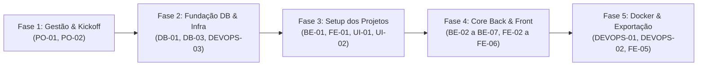

# Registro de Planejamento da Sprint 1

- **Projeto:** GreenER — Plataforma de Estimativa do Impacto Ambiental de Software
- **Semestre/Curso:** 2º DSM — Fatec Jacareí
- **Data da Sprint Review 1:** 19/10/2026 às 19h30
- **Arquivo de Origem:** `docs/sprints/sprint-1.md`

---

## 1. Objetivo da Sprint 1

Construir e disponibilizar a **arquitetura base e o fluxo funcional de ponta a ponta (MVP)** do GreenER em ambiente totalmente containerizado via Docker. O escopo compreende a execução do _worker_ de ingestão e _polling_ de métricas, consumo do fator de carbono regional, cálculo socioambiental automatizado (Potência, Energia e CO₂e), persistência em banco PostgreSQL nativo sem ORM, **autenticação JWT da área restrita (login e proteção de rotas)**, exibição em tempo real na interface web React em TypeScript e o **Mecanismo Global de Exportação de Relatórios Gerenciais (PDF e CSV)**.

> **Nota de escopo:** a **autenticação JWT (RP06)** foi antecipada para a Sprint 1 para que a tabela `usuarios` já nasça utilizada, que o provimento de segredos (`.env` / `JWT_SECRET`) faça parte da infraestrutura Docker desde o início e que a área de configuração protegida sirva de base para as evoluções das próximas sprints.

---

## 2. Indicadores e Meta da Sprint (Story Points & Rubrica)

- **Capacidade Mapeada da Sprint:** 82 Story Points (distribuídos entre 25 tarefas).
- **Critérios da Rubrica Fatec Declarados:** ES01 a ES09 (40 pts), DW01 (3 pts), DW02 (5 pts), DW03 (6 pts), DW04 (4 pts), DW05 (3 pts), DW06 (6 pts), DW07 (3 pts), BD01 (4 pts), BD02 (6 pts), BD03 (2 pts), TP01 (6 pts), TP02 (6 pts) e TP03 (6 pts).
- **Pontuação Máxima Alvo:** 100 Pontos da Rubrica.
- **Acréscimo desta revisão:** +13 Story Points / +4 tarefas referentes à **autenticação JWT (RP06 / DW06)** e ao provimento de segredos do ambiente Docker.

---

## 3. Sequência Lógica de Execução (Fases de Desenvolvimento)

Para otimizar o fluxo de trabalho da equipe e respeitar as dependências técnicas entre banco, backend e frontend, as tarefas devem ser atacadas nas seguintes fases:

---

## 4. Sprint Backlog, Estimativas e Distribuição de Responsáveis

> 🤝 **Princípio da Colaboração Ágil:** A indicação de um **Responsável Principal** garante a rastreabilidade individual exigida nas rubricas da Fatec (ES05/ES06) e um equilíbrio justo de carga de trabalho (~16 Story Points por integrante). No entanto, toda a equipe pratica *Pair Programming* e cooperação mútua em qualquer camada sempre que necessário.

| Código | Camada | Descrição da Tarefa / Entregável | Critério Fatec | Requisito | Points | Responsável Principal | Apoio / Colaboração |
| :--- | :--- | :--- | :---: | :---: | :---: | :--- | :--- |
| **PO-01** | Gestão | Versionamento do arquivo `docs/plano-de-entregas.md`. | ES01, ES02 | RP05, RP07 | **2** | **Henrique Camargo** | Gabriel Travensolli |
| **PO-02** | Gestão | Cadastro, priorização e vinculação das Issues no GitHub. | ES04, ES09 | RP07 | **2** | **Henrique Camargo** | Gabriel Travensolli |
| **DB-01** | Banco | Script DDL `database/schema.sql` com tabelas, PK/FK e restrições. | BD01 | RP03, RF10 | **3** | **Lucas Amorim** | Vinicius Augusto |
| **DB-03** | Banco | Script de seed `database/seed.sql` com usuário admin (hash bcrypt). | BD01 | RP06 | **2** | **Vinicius Augusto** | Lucas Amorim |
| **DEVOPS-03** | DevOps | Provisionamento de segredos: `.env.example` e `JWT_SECRET` no compose. | DW07, DW06 | RP04, RP06 | **3** | **Henrique Camargo** | Lucas Amorim |
| **BE-01** | Backend | Setup da API REST Node.js/TS em camadas (módulos, controllers, etc.). | DW01, DW03 | RP02 | **3** | **Lucas Amorim** | Vinicius Augusto |
| **FE-01** | Frontend | Setup do projeto React + TypeScript + Vite + Tailwind (RP01). | DW01, DW04 | RP01 | **2** | **Gabriel Travensolli** | Andrea Turibio |
| **UI-01** | Design | Protótipo de alta fidelidade no Figma (KPIs, lista e modal). | ES03, RP05 | RNF01 | **5** | **Gabriel Travensolli** | Andrea Turibio |
| **UI-02** | Design | Definição do Design System Dark Mode (`slate-950`, `emerald-500`). | ES07 | RNF01 | **2** | **Gabriel Travensolli** | Andrea Turibio |
| **UI-03** | Design | Componentização do indicador visual de última atualização. | ES03 | RNF02 | **1** | **Gabriel Travensolli** | Andrea Turibio |
| **UI-04** | Design | Layout do Relatório Executivo PDF (Cabeçalho, KPIs e tabela impressa). | ES03, RP05 | Diferencial | **2** | **Andrea Turibio** | Gabriel Travensolli |
| **DB-02** | Banco | Repositories com SQL puro parametrizado no driver `pg` (Sem ORM). | BD02 | RP03, RF10 | **5** | **Lucas Amorim** | Vinicius Augusto |
| **BE-02** | Backend | Cliente HTTP para consumo da API Agregadora de Métricas. | DW02, DW03 | RF01, RF03 | **3** | **Lucas Amorim** | Vinicius Augusto |
| **BE-03** | Backend | Tratamento de exceções (HTTP 500 `unavailable` e 404 `metrics_missing`). | DW02, TP03 | RF05, RF06, RNF04 | **3** | **Lucas Amorim** | Vinicius Augusto |
| **BE-04** | Backend | Cliente HTTP para consumo da API de Intensidade de Carbono. | DW02 | RF07 | **2** | **Vinicius Augusto** | Lucas Amorim |
| **BE-05** | Backend | Domain Service do Cálculo Socioambiental com constantes oficiais. | TP01, TP02, DW03 | RF07 | **5** | **Vinicius Augusto** | Lucas Amorim |
| **BE-06** | Backend | Worker/Cron em segundo plano para o ciclo de coleta periódica. | DW03 | RF02, RF04 | **5** | **Vinicius Augusto** | Lucas Amorim |
| **BE-07** | Backend | Autenticação JWT: rota `POST /login` (bcrypt) e middleware de rotas. | DW06, TP03 | RP06 | **5** | **Vinicius Augusto** | Lucas Amorim |
| **FE-02** | Frontend | Componentização dos Cards de KPI Executivos (kWh, gCO₂e, serviços). | DW04, DW05 | RF08, RF09 | **3** | **Gabriel Travensolli** | Andrea Turibio |
| **FE-03** | Frontend | Tabela Operacional de Serviços com badges de status e localização. | DW04, DW05 | RF09, RF12 | **5** | **Andrea Turibio** | Gabriel Travensolli |
| **FE-04** | Frontend | Hook customizado de _polling_ e cronômetro de atualização sem reload. | DW05 | RF11, RNF02 | **5** | **Andrea Turibio** | Gabriel Travensolli |
| **FE-05** | Frontend | Hook/Módulo Global de Exportação de Dados (Geração de CSV e PDF). | DW04 | Diferencial | **5** | **Andrea Turibio** | Gabriel Travensolli |
| **FE-06** | Frontend | Tela de Login, guarda de rotas e armazenamento do token (área restrita). | DW06 | RP06 | **3** | **Henrique Camargo** | Gabriel Travensolli |
| **DEVOPS-01** | DevOps | Dockerfiles otimizados para Frontend e Backend. | DW07 | RP04 | **3** | **Gabriel Travensolli** | Henrique Camargo |
| **DEVOPS-02** | DevOps | Configuração do `compose.yaml` com volume persistente PostgreSQL. | DW07, BD03 | RP04, RNF05 | **3** | **Henrique Camargo** | Gabriel Travensolli |

### ⚖️ Balanço de Capacidade por Integrante

| Integrante | Papel Principal | Tarefas Atribuídas | Story Points Alocados |
| :--- | :--- | :--- | :---: |
| **Gabriel Travensolli** | Scrum Master / Front / UI | `UI-01`, `UI-02`, `UI-03`, `FE-01`, `FE-02`, `DEVOPS-01` | **16 pts** |
| **Andrea Turibio** | Dev Front-end / UI | `UI-04`, `FE-03`, `FE-04`, `FE-05` | **17 pts** |
| **Lucas Amorim** | Dev Back-end / DB | `DB-01`, `DB-02`, `BE-01`, `BE-02`, `BE-03` | **17 pts** |
| **Vinicius Augusto** | Dev Back-end / Segurança | `DB-03`, `BE-04`, `BE-05`, `BE-06`, `BE-07` | **19 pts** |
| **Henrique Camargo** | Product Owner / Gestão & DevOps | `PO-01`, `PO-02`, `FE-06`, `DEVOPS-02`, `DEVOPS-03` | **13 pts + Gestão** |
| **Total da Sprint 1** | — | **25 tarefas** | **82 pts** |

---

## 5. Definition of Done (DoD) da Sprint 1

Para que qualquer tarefa ou história seja considerada **Concluída**, os seguintes critérios devem ser atendidos rigorosamente:

1. **Padrão Code Base:** Código escrito em TypeScript estrito, sem utilização de `any` injustificado.
2. **Restrição de Banco de Dados:** **Proibição total de ORMs** (Prisma, TypeORM, etc.). Toda interação com o PostgreSQL deve ser feita via DML SQL puro parametrizado no driver `pg`.
3. **Resiliência de Ingestão:** Métricas do worker devem tratar erros HTTP 500 e 404 sem derrubar a API ou interromper a coleta dos demais serviços.
4. **Mecanismo de Exportação:** Toda visualização principal ou tabela deve possuir suporte a exportação em CSV estruturado e impressão/PDF estilizado.
5. **Reprodutibilidade Docker:** A aplicação deve subir completamente via comando `docker compose up --build` sem erros de conexão, incluindo o provisionamento de segredos via `.env` (o `.env.example` deve conter um `JWT_SECRET` de desenvolvimento funcional).
6. **Segurança de Acesso (JWT):** A área restrita (configuração) só é acessível com token válido. Rotas protegidas retornam `401` sem token e `403` com token expirado/inválido. Senhas nunca são armazenadas em texto puro (bcrypt).
7. **Rastreabilidade Git:** Commits devem conter a referência explícita do código da tarefa (ex: `feat(frontend): adiciona suporte a relatorio pdf #FE-05`).

---

## 6. Rastreabilidade e Evidências da Rubrica (`docs/plano-de-entregas.md`)

Tabela consolidada do planejamento para preenchimento de evidências ao final da sprint:

| Código | Requisito Relacionado | Entrega Concreta | Como Verificar | Responsáveis | Evidência no GitHub | Situação |
| :--- | :--- | :--- | :--- | :--- | :--- | :--- |
| **ES01 - ES09** | RP07 | Backlog, DoD, gestão de issues, participação e atas de reunião. | Inspecionar a aba Issues, PRs, commits e a pasta `docs/`. | Product Owner / Time | `docs/plano-de-entregas.md` e `docs/sprints/sprint-1.md` | Pendente |
| **DW01** | RP01, RP02 | Projetos Frontend (React) e Backend (Node.js) em TypeScript. | Conferir `package.json` e estruturas de pastas `src/`. | Time Dev | `/frontend` e `/backend` | Pendente |
| **DW02** | RF01, RF03, RF07 | Ingestão das APIs de Métricas e Carbono com fallback. | Conferir chamadas e logs do worker de coleta em segundo plano. | Dev Backend | `backend/src/integrations/` | Pendente |
| **DW03** | RP02 | Backend REST em rotas, controllers, services e repositories. | Verificar separação de camadas nas pastas do backend. | Dev Backend | `backend/src/modules/` | Pendente |
| **DW04 / DW05** | RF09, RF11 | Dashboard React com KPIs, tabela, exportação (PDF/CSV) e atualização em tempo real. | Executar o frontend, observar atualização sem reload e testar botões de exportação. | Dev Frontend | `frontend/src/` | Pendente |
| **DW06** | RP06 | Autenticação JWT: login (bcrypt), emissão de token e middleware de rotas protegidas. | Acessar área restrita sem token (`401`) e com login válido; conferir hash de senha no banco. | Dev Backend / Frontend | `backend/src/modules/auth/` e `frontend/src/` | Pendente |
| **DW07 / BD03** | RP04, BD03 | Docker Compose integrando Apps e PostgreSQL com Volume Persistente. | Executar `docker compose up` e reiniciar container mantendo dados. | DevOps | `compose.yaml` | Pendente |
| **BD01 / BD02** | RP03, RF10 | Script DDL `schema.sql` e Repositories SQL parametrizados sem ORM. | Executar `schema.sql` em banco limpo e checar placeholders no código. | Dev DB / Backend | `database/schema.sql` e Repositories | Pendente |
| **TP01 - TP03** | RP02, RNF04 | Domain Service orientado a objetos, tipagem forte e `try/catch`. | Inspecionar classes de serviço, interfaces e blocos de exceção. | Dev Backend | `backend/src/modules/` | Pendente |

---

## 7. Registro de Revisão e Decisões (Sprint Review 1)

*(A ser preenchido na reunião do dia 19/10/2026 após o feedback do professor e cliente UniLaunch)*

- **Status da Entrega:** [ ] Aprovado de Primeira | [ ] Aprovado com Ressalvas
- **Pontos Fortes Destacados:**
- **Oportunidades de Melhoria / Retorno Recebido:**
- **Ajustes Mapeados para a Sprint 2:**
